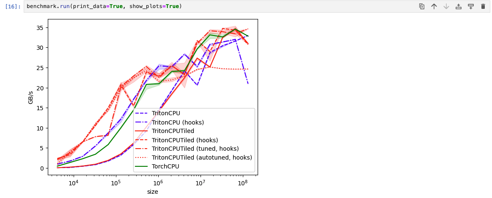

# triton-jupyter-notebook

This is an example of how to run the triton-cpu examples in a container via Jupyter notebooks.

## Prerequisites

* **Docker** or **Podman**
* **NVIDIA Container Toolkit for GPU Usage**
* **VSCode Dev Containers Extension**

> **_NOTE_**: If you are using an NVIDIA GPU, you also need to complete the steps
  to install the [NVIDIA Container Toolkit](https://docs.nvidia.com/datacenter/cloud-native/container-toolkit/latest/install-guide.html).

## Build the docker image

### Triton CPU

```bash
docker build --build-arg USERNAME=$USER --build-arg NPROC=$(nproc) -t triton-cpu-jupyter -f Dockerfile.triton-cpu .
```

## Run the docker image

```bash
$ docker run  -p 8888:8888 -v /<path-to-dir>/triton-jupyter/notebooks:/notebooks triton-jupyter
[I 2024-11-26 16:57:27.709 ServerApp] jupyter_lsp | extension was successfully linked.
[I 2024-11-26 16:57:27.716 ServerApp] jupyter_server_terminals | extension was successfully linked.
[I 2024-11-26 16:57:27.723 ServerApp] jupyterlab | extension was successfully linked.
[I 2024-11-26 16:57:27.729 ServerApp] notebook | extension was successfully linked.
[I 2024-11-26 16:57:27.731 ServerApp] Writing Jupyter server cookie secret to /opt/app-root/src/.local/share/jupyter/runtime/jupyter_cookie_secret
[I 2024-11-26 16:57:28.119 ServerApp] notebook_shim | extension was successfully linked.
[I 2024-11-26 16:57:28.168 ServerApp] notebook_shim | extension was successfully loaded.
[I 2024-11-26 16:57:28.174 ServerApp] jupyter_lsp | extension was successfully loaded.
[I 2024-11-26 16:57:28.177 ServerApp] jupyter_server_terminals | extension was successfully loaded.
[I 2024-11-26 16:57:28.184 LabApp] JupyterLab extension loaded from /opt/app-root/lib64/python3.12/site-packages/jupyterlab
[I 2024-11-26 16:57:28.185 LabApp] JupyterLab application directory is /opt/app-root/share/jupyter/lab
[I 2024-11-26 16:57:28.187 LabApp] Extension Manager is 'pypi'.
[I 2024-11-26 16:57:28.231 ServerApp] jupyterlab | extension was successfully loaded.
[I 2024-11-26 16:57:28.243 ServerApp] notebook | extension was successfully loaded.
[I 2024-11-26 16:57:28.244 ServerApp] Serving notebooks from local directory: /notebooks
[I 2024-11-26 16:57:28.244 ServerApp] Jupyter Server 2.14.2 is running at:
[I 2024-11-26 16:57:28.244 ServerApp] http://3de8f9b18027:8888/tree?token=74cbac9d4ae95aff21362227b0d94cb96951d3bbf372cc9b
[I 2024-11-26 16:57:28.244 ServerApp]     http://127.0.0.1:8888/tree?token=74cbac9d4ae95aff21362227b0d94cb96951d3bbf372cc9b
[I 2024-11-26 16:57:28.245 ServerApp] Use Control-C to stop this server and shut down all kernels (twice to skip confirmation).
[C 2024-11-26 16:57:28.253 ServerApp]

    To access the server, open this file in a browser:
        file:///opt/app-root/src/.local/share/jupyter/runtime/jpserver-1-open.html
    Or copy and paste one of these URLs:
        http://3de8f9b18027:8888/tree?token=74cbac9d4ae95aff21362227b0d94cb96951d3bbf372cc9b
        http://127.0.0.1:8888/tree?token=74cbac9d4ae95aff21362227b0d94cb96951d3bbf372cc9b
[I 2024-11-26 16:57:28.732 ServerApp] Skipped non-installed server(s): bash-language-server, dockerfile-language-server-nodejs, javascript-typescript-langserver, jedi-language-server, julia-language-server, pyright, python-language-server, python-lsp-server, r-languageserver, sql-language-server, texlab, typescript-language-server, unified-language-server, vscode-css-languageserver-bin, vscode-html-languageserver-bin, vscode-json-languageserver-bin, yaml-language-server
```
Navigate to one of the URLs outputted above and the notebooks will be mounted in the container at `/notebooks`.

Open a notebook and run it. An example of the output of [01-vector-add.pynb](./01-vector-add.ipynb) is shown below:



> **_NOTE_** A CPU with AVX512 is needed to run [02-fused-softmax-cpu.ipynb](./02-fused-softmax-cpu.ipynb).
debug of the other notebooks is in progress.

## Converting python files to Jupyter notebooks

```
pip install p2j
p2j script.py
```